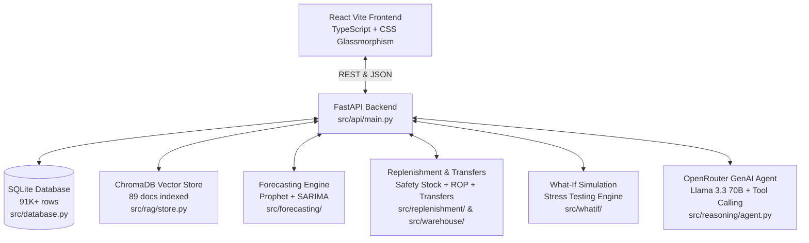

# GenAI Inventory & Demand-Forecasting Assistant — Runbook & Documentation

## 1. System Overview

The **GenAI Inventory & Demand-Forecasting Assistant** is an enterprise-grade AI decision-support platform for modern supply-chain and inventory operations. It bridges the gap between raw statistical forecasting and business context by:
1. Predicting SKU-level daily demand using **Prophet** (with Indian festival calendar regressors) and **SARIMA**.
2. Calculating dynamic **Safety Stock**, **Reorder Points (ROP)**, and **Economic Order Quantities (EOQ)**.
3. Automatically discovering **Inter-Warehouse Transfer Opportunities** (rebalancing surplus stock to deficit hubs faster and cheaper than supplier purchase orders).
4. Providing a **What-If Scenario Simulator** for stress-testing demand shocks and supplier delays.
5. Indexing supply chain policies, festival calendars, and supplier disruptions in **ChromaDB** for context retrieval.
6. Running a multi-model **GenAI Reasoning Copilot** via OpenRouter free routes (Llama 3.3 70B, GPT-OSS, DeepSeek, Qwen) with tool calling and a smart heuristic fallback.
7. Requiring **Human-in-the-Loop approval** for all replenishment and transfer recommendations before execution.

---

## 2. Architecture & Tech Stack



### Stack Components
- **Backend:** Python 3.11+, FastAPI, Uvicorn, SQLAlchemy 2.0 ORM, Pydantic v2.
- **Database:** SQLite (local WAL mode, zero external daemon required).
- **RAG Vector Database:** ChromaDB 1.5.9 with ONNX `all-MiniLM-L6-v2` embeddings.
- **Forecasting:** Prophet 1.1.5 + Statsmodels (SARIMA / Holt-Winters Exponential Smoothing).
- **GenAI Reasoning:** OpenRouter OpenAI-compatible client (`meta-llama/llama-3.3-70b-instruct:free`) with autonomous tool calling.
- **Frontend:** React 19, TypeScript, Vite 8, Recharts (time-series & area charts), Lucide Icons, Vanilla CSS design system.

---

## 3. Dataset & Ingestion Stats

The database has been fully ingested and verified from the enriched dataset:

| Entity | Count | Details |
|---|---|---|
| **Sales History** | **91,250 records** | Daily sales across 50 SKUs & 5 warehouses (Jan–Dec 2024) |
| **Inventory Levels** | **91,250 records** | On-hand, on-order, ROP, and stockout flags |
| **SKU Master** | **50 SKUs** | Categorized into Budget, Economy, Standard, Premium, Luxury |
| **Warehouses** | **5 Hubs** | WH_01 (Delhi), WH_02 (Mumbai), WH_03 (Chennai), WH_04 (Kolkata), WH_05 (Pune) |
| **Distance Matrix** | **25 pairs** | 5×5 inter-warehouse distance (km) and unit transfer cost (₹) |
| **Supplier Lead Times**| **211 records** | SKU-to-supplier lead time mappings (days) |
| **ChromaDB Documents** | **89 docs** | 19 Indian festivals + 70 supply chain disruption & supplier records |

---

## 4. Quick Start Guide

### Option A: One-Click Launch (PowerShell)
```powershell
.\start_dev.ps1
```
This automatically launches both the FastAPI backend (port 8000) and the React frontend (port 5173) in concurrent windows.

### Option B: Manual Startup

**Terminal 1 — Backend:**
```powershell
# From project root
python -m uvicorn src.api.main:app --reload --port 8000
```
- API Health Check: [http://localhost:8000/health](http://localhost:8000/health)
- Swagger Interactive Docs: [http://localhost:8000/docs](http://localhost:8000/docs)

**Terminal 2 — Frontend:**
```powershell
cd frontend
npm run dev
```
- React Web App: [http://localhost:5173](http://localhost:5173)

---

## 5. RAG & Ingestion Commands

If you ever want to re-run ingestion or rebuild vector embeddings:
```powershell
# Ingest data into SQLite database
python -m src.ingestion.load

# Ingest festivals & knowledge documents into ChromaDB
python -m src.rag.ingest
```

---

## 6. Configuring Your OpenRouter API Key

When you are ready to use live OpenRouter inference:
1. Open `.env` in the project root:
```ini
OPENROUTER_API_KEY=sk-or-v1-your-real-key-here
OPENROUTER_MODEL=meta-llama/llama-3.3-70b-instruct:free
OPENROUTER_FALLBACK_MODELS=openai/gpt-oss-20b:free,deepseek/deepseek-r1-distill:free,qwen/qwen3-32b:free
```
2. The assistant will automatically use live OpenRouter tool calling with zero code changes!
3. If no key is set, the system runs in high-fidelity smart simulation mode using the actual forecasting, replenishment, and transfer engines.
